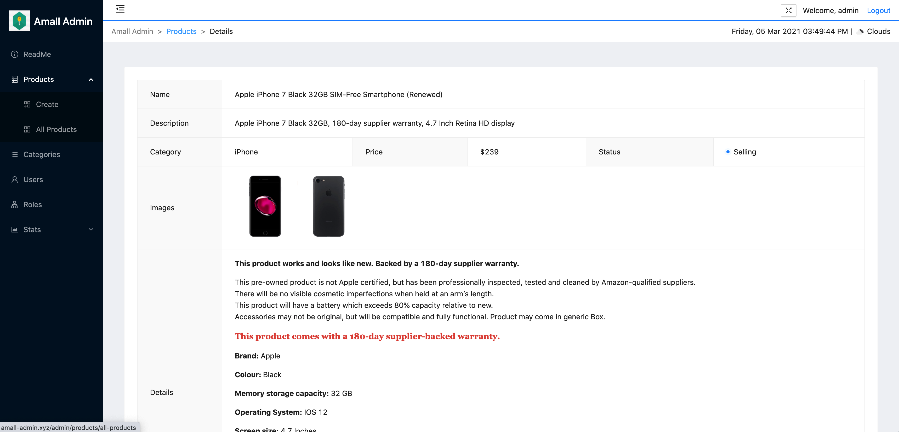
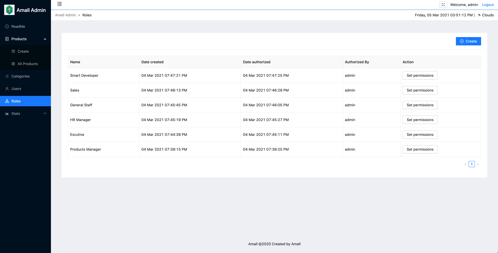

# Amall Admin (Client Side)

This repo stores the front-end application (client side) of Amall Admin

## Project Introduction

Amall Admin

- is a SPA with distributed front-end and back-end application
- aims to help clients manage their online store and staff easily
- includes user management, categories management, products management, roles management and other functional modules
- Front-end technology stack: React + React router + Redux, Antd, JavaScript(es6), Webpack, etc.
- Backend technology stack: Node, Express, MongoDB, etc.
- is running on AWS EC2 and accessible to the public

## Project Structure

Front-end: https://github.com/Nathan-Mu/Amall-Admin

Back-end: TBD (private now, polishing the documentation and fixing bugs)

## Online Demo

Availble on http://amall-admin.xyz






## Technologies / Libraries

| Name                | Description                                       | Office Website / GitHub Repo                   |
| ------------------- | ------------------------------------------------- | ---------------------------------------------- |
| React               | A JavaScript library for building user interfaces | https://reactjs.org/                           |
| React-Router        | Declarative Routing for React.js                  | https://reactrouter.com/                       |
| Redux               | A predictable state container for JavaScript apps | https://redux.js.org/                          |
| React-Redux         | Official React bindings for Redux                 | https://react-redux.js.org/                    |
| Ant Design          | Front-end UI library                              | https://ant.design/                            |
| AntV G2Plot         | A data visualization library                      | https://g2plot.antv.vision/                    |
| Axios               | Promise based HTTP client                         | https://github.com/axios/axios                 |
| customize-cra       | A library for overriding webpack configurations   | https://github.com/arackaf/customize-cra       |
| dayjs               | A library for datetime format conversion          | https://github.com/iamkun/dayjs                |
| node-sass           | Node.js bindings to libsass                       | https://github.com/sass/node-sass              |
| screenfull          | A library packed JavaScript Fullscreen API        | https://github.com/sindresorhus/screenfull.js/ |
| pubsub-js           | A publish/subscribe library                       | https://github.com/mroderick/PubSubJS          |
| react-draft-wysiwyg | A library for building rich text editor           | https://github.com/jpuri/react-draft-wysiwyg   |

## File Structure

```
src 
├── Api
    ├── axios-config.js
    ├── backend-api.js
    └── weather-api.js
├── Components
    ├── Admin
    ├── Categories
    ├── Login
    ├── Products
		└── ...
├── Config
    ├── index.js
    ├── menu.jsx
    ├── route.jsx
    └── ... 
├── Img
├── Redux
		├── actions
    ├── reducers
    ├── action_types.js
    └── store.js 
├── App.js
└── index.js
```

## Routes

```
├── /login * Login.jsx
└── /admin * Admin.jsx
    ├── /readme * ReadMe.jsx
    ├── /products
    		├── /all-products * Products.jsx
        ├── /create * Editable.jsx
        ├── /edit:id * Editable.jsx
        └── /details:id * Details.jsx
    ├── /categories * Categories.jsx
    ├── /users * Users.jsx
    ├── /roles * Roles.jsx
    └── /stats
        ├── /revenue * Revenus.jsx
        ├── /marketing * Marketing.jsx
        └── /visits * Visits.jsx
```


## To run the project

1. Change the `BASE_URL` in `axios-config.js` to http://amall-admin.xyz:4000

2. Run

   ```bash
   $ npm install
   $ npm start
   ```

3. Then you can visit the website locally on http://localhost:3000

## At the end

My name is Nathan, a smart developer and keep learning all the time. If you are hiring a smart web developer, or you know some one who is hiring, please let me know the opportunity. And you won't be regret doing so. Thank you ^_^